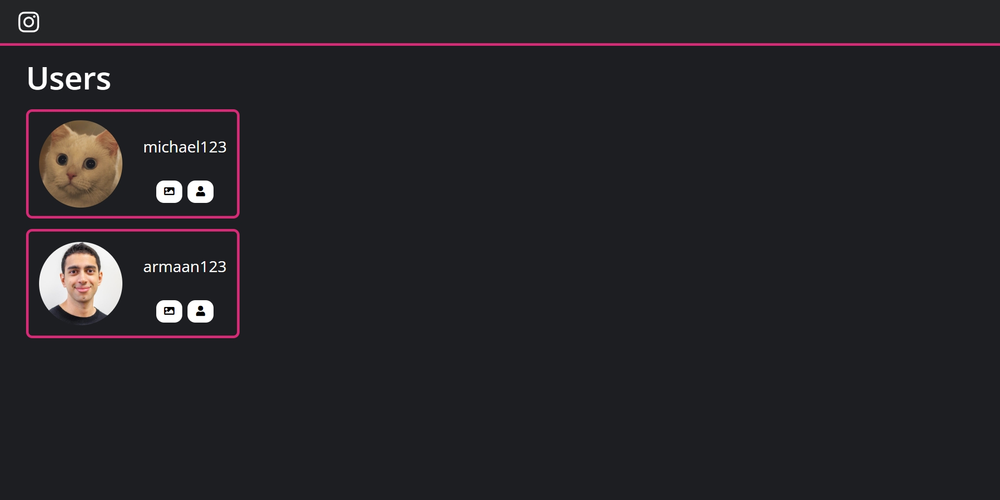
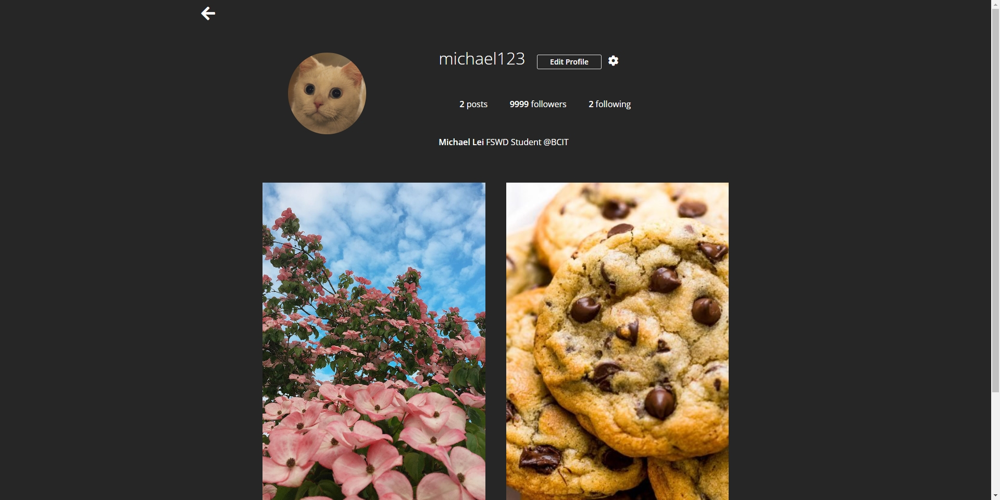

#  Instagram Clone

## Summary

A milestone project, I had to do in class during COMP 1320: Intro to Software Development.

It is a basic instagram clone that allows you to upload and view pictures.

## How to install

### 1. Clone the Repository

```git
git clone https://github.com/michaeleii/instagram-clone.git
```

### 2. Install the dependencies

```npm
npm i
```

### 3. Start the server

```npm
npm start
```

### 4. Visit in your browser

```url
http://localhost:3000
```

## Learning Outcomes

- Using Formidable Library to upload images to the user's feed
- Used HTTP to handle `GET` and `POST` requests
- Used Promises to make sure the code runs asynchronously
- Used Socket.io to update user's feed in real-time by establishing a Websocket connection with homepage to the user's feed

## Homepage



## User's Feed


